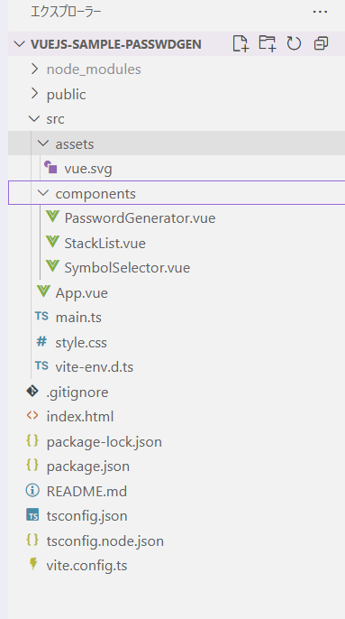

# vuejs-test
参考: https://github.com/murcubcc110/offjt4cct/blob/main/ts_vuejs/docs/4.0.vue_menu.md  
  - このハンズオンは **パスワードジェネレーターを完成させる** のがゴール。  
  - 環境構築（例：`npm create vite@latest app`）が終わると、`app` フォルダ配下に **`package.json` を含む** いくつかのファイルが作成される。  
  - それらのファイルを **手順に沿って** 編集していくと、最終的にパスワードジェネレーターが完成する。  
  - 事前確認したい場合は、`https://github.com/murcubcc110/vuejs-sample-passwdgen` をクローンして `npm install` → `npm run dev` で動作確認できる（自分はクローンの動作確認のみ実施）。
  - 最終ファイル構成
    
---
## Node.js のバージョンと導入
- node18がEOLとなっている,最新を導入した　msiをつかった。Dockerは使わず
- PowerShell の実行ポリシー変更。`npm create vite@latest -y`の時に必要となった
    ```
    Set-ExecutionPolicy -Scope CurrentUser -ExecutionPolicy RemoteSigned -Force
    ```

## プロジェクト作成時のプロンプト（入力待ちの画面）

> **メモ**：表示が止まっているように見えても「入力待ち」の場合があります。プロンプトに沿って入力してください。

- **Project name**: `app`（任意。手順に合わせるなら `app`）
- **Select a framework**: `Vue`
- **Select a variant**: `TypeScript`

> これらのプロンプトは、次のように **テンプレートを指定** すれば **スキップ** できます：  
> `npm create vite@latest app -- --template vue-ts`


## VS Code のプラグイン（任意／入らなくても動作に影響なし）

- **TypeScript Vue Plugin (Volar)** … インストールできなかった
- **Vue Language Features (Volar)** … インストールできなかった
- **Vetur** … インストールできなかった

> いずれも **エディタの補完や型サポート向け**で、**アプリの起動や動作には不要**です。  
> ブラウザの **Vue Devtools** を使う場合は、`npm run dev` で起動した  
> **[`http://localhost:5173`](http://localhost:5173)** のような URL を開いてください


## パスワードジェネレーターを動かす方法
  - https://github.com/murcubcc110/vuejs-sample-passwdgen をクローンして(1)で動いた
    ```
    git clone <あなたのリポジトリURL>
    cd <プロジェクト名>

    # どのパッケージマネージャを使うかは “ロックファイル” で判断
    # 1) package-lock.json がある → npm
    npm ci      # なければ npm install でも可
    npm run dev

    # 2) pnpm-lock.yaml がある → pnpm
    #    (初回だけ) corepack enable
    #    corepack prepare pnpm@latest --activate  # 必要なら
    # pnpm install
    # pnpm dev

    # 3) yarn.lock がある → yarn
    #    (初回だけ) corepack enable
    # yarn
    # yarn dev
    ```
    

    うまく起動しない場合は、プロジェクト直下（package.json のある場所）で実行しているか、npm run でスクリプト一覧を確認。

##  Vueってなに？

Web画面を作るためのJavaScriptフレームワーク。

ボタンを押したら数字が増える、入力したら画面が変わる…みたいな**“動くUI”を超カンタンに書ける**ようにしてくれる。

コンポーネントという小さな部品を組み合わせて画面を作る。

データが変わると、Vueが自動でDOMを書き換えて見た目を更新してくれる（＝リアクティブ）。
ふつうは .vue という1ファイルに、見た目・ロジック・スタイルをまとめる

## npmの「scripts」（今回いちばん重要）

**package.json の "scripts" に書く“作業コマンドの別名”**です。

例（Vite プロジェクトの定番）：
```json
{
    "scripts": {
        "dev": "vite",
        "build": "vue-tsc -b && vite build",
        "preview": "vite preview"
    }
}
```

実行は npm run dev / npm run build のように短く呼べる“ボタン”だと思えばOK。

何が実行されるかは package.json を見れば分かります。npm run で一覧表示もできます。

- npm run dev：開発用。ローカルで即動くサーバを立てる（HMR＝保存で即反映）。
- npm run build：本番用。最適化された静的ファイルを dist/ に出力。

##  Vite（ヴィート）って？

- 超高速の “開発サーバ & ビルドツール”（作者: Evan You）。
- Vue だけでなく React / Svelte / Vanilla JS でも利用可能。
- 開発時は 未バンドル＋ESM 配信 で起動・更新が速い（HMR）。
- 本番ビルドは Rollup で最適化（圧縮・コード分割・ハッシュ付与）。

```
# 開発
npm install
npm run dev

# 本番ビルド
npm run build

# 本番プレビュー
npm run preview
```
Node 20 LTS 以上 なら npm create vite@latest app -- --template vue-ts で最新テンプレを作成可能。
もし歴史的に Node 18 を使う場合は npm create vite@6 のように 旧版 を指定する（最新は Node 20+ を要求）。