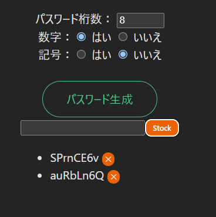

# vuejs-test

- node18がEOLとなっている,最新を導入した
- PowerShell の実行ポリシー変更 
```
Set-ExecutionPolicy -Scope CurrentUser -ExecutionPolicy RemoteSigned -Force
```
- 書いてあった。マニュアルの見方に慣れよう
  - Project name: app
  - Select a framework: Vue
  - Select a variant: TypeScript
- plugin
  - TypeScript Vue Plugin (Volar) 入らなかった
  - Vue Language Features (Volar)　入らなかった
  - Vetur入らなかった
- パスワードジェネレーターを動かす方法
- https://github.com/murcubcc110/vuejs-sample-passwdgen をクローンして(1)で動いた
```
git clone <あなたのリポジトリURL>
cd <プロジェクト名>

# どのパッケージマネージャを使うかは “ロックファイル” で判断
# 1) package-lock.json がある → npm
npm ci      # なければ npm install でも可
npm run dev

# 2) pnpm-lock.yaml がある → pnpm
#    (初回だけ) corepack enable
#    corepack prepare pnpm@latest --activate  # 必要なら
# pnpm install
# pnpm dev

# 3) yarn.lock がある → yarn
#    (初回だけ) corepack enable
# yarn
# yarn dev
```
